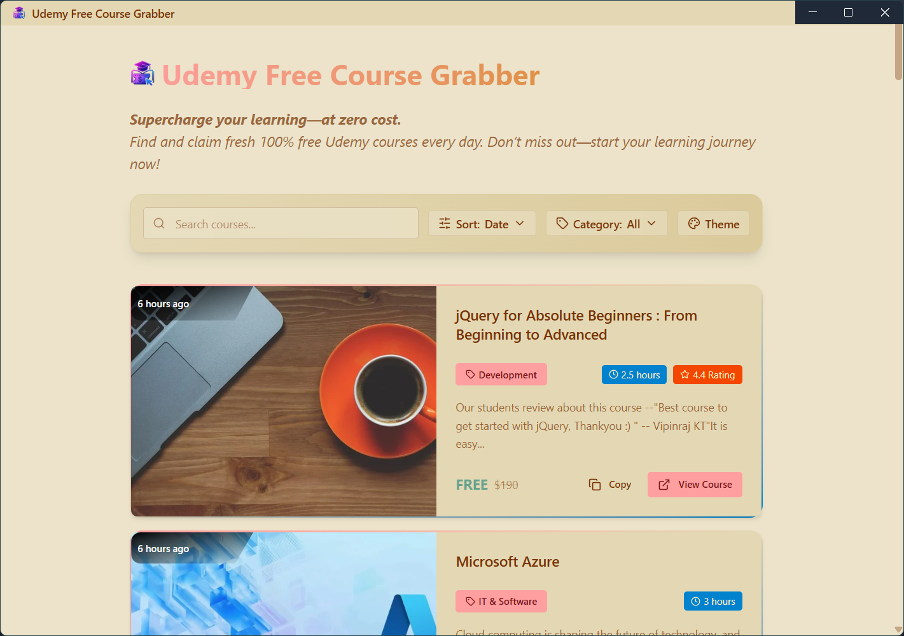
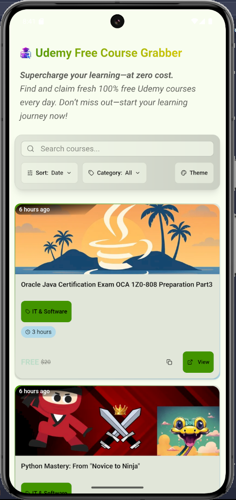
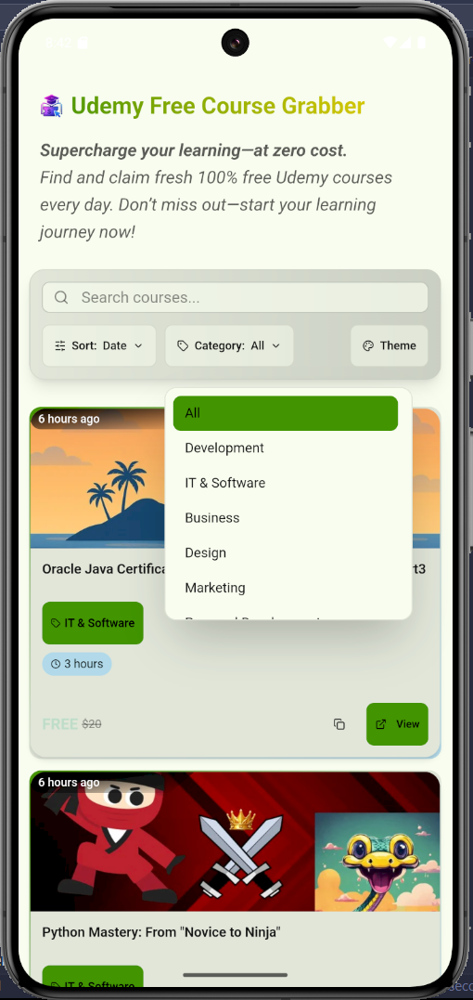

# Udemy Free Course Grabber

<div align="center">


_A cross-platform application to discover and access free Udemy courses_

[](LICENSE)
[](https://github.com/yourusername/udemy-course-grabber)
[](https://reactjs.org/)
[](https://electronjs.org/)
[](https://capacitorjs.com/)

[📱 Download Android APK](#installation) • [💻 Download Desktop App](#installation)

</div>

## 📸 Screenshots

### Desktop Application (Electron)



_Main interface showing course listings with filters and search_


_Dark mode support for comfortable browsing_

### Mobile Application (Android)

<div align="center">


</div>

_Mobile interface optimized for touch interactions_

## ✨ Features

### 🎯 Core Features

- **Free Course Discovery**: Browse thousands of free Udemy courses
- **Smart Filtering**: Filter by category, rating, duration, and popularity
- **Real-time Search**: Instant search with live results
- **Course Details**: View ratings, duration, instructor info, and descriptions
- **Direct Access**: Open courses directly in your default browser or Udemy app

### 🎨 User Experience

- **Responsive Design**: Seamless experience across desktop and mobile
- **Dark/Light Theme**: Toggle between themes for comfortable viewing
- **Intuitive Navigation**: Clean, modern interface with easy navigation

### 🛠 Technical Features

- **Cross-Platform**: Single codebase for both desktop and mobile
- **Modern Tech Stack**: React + Vite + TailwindCSS + DaisyUI
- **Native Performance**: Electron for desktop, Capacitor for mobile
- **Auto-Updates**: Built-in update mechanism for new releases
- **Privacy-Focused**: No personal data collection or tracking

## 🚀 Quick Start

### Prerequisites

- **For Desktop**: Windows 10/11
- **For Mobile**: Android 7.0+ (API level 24+)

### Installation

#### 📱 Android

1. Download the latest APK from [Releases](https://github.com/N00BSC00B/Udemy-Free-Course-Grabber/releases)
2. Enable "Install from Unknown Sources" in your Android settings
3. Install the APK file
4. Launch the app and start discovering courses!

#### 💻 Desktop (Windows)

1. Download the installer from [Releases](https://github.com/N00BSC00B/Udemy-Free-Course-Grabber/releases)
2. Run the installer
3. Launch the application from Start Menu or Desktop shortcut
4. Start browsing free courses immediately!

## 🔧 Development Setup

### Prerequisites

- Node.js 18+
- npm or yarn
- For Android development: Android Studio + SDK
- For desktop development: No additional requirements

### Clone and Install

```bash
git clone https://github.com/N00BSC00B/Udemy-Free-Course-Grabber.git
cd /Frontend
npm install
```

### Development Commands

```bash
# Start development server (web)
npm run dev

# Start Electron development
npm run electron:dev

# Start Android development
npm run android:dev

# Build for production
npm run build

# Build Electron app
npm run electron:build

# Build Android APK
npm run android:build
```

### Project Structure

```
Frontend/
├── src/
│   ├── components/          # React components
│   │   ├── CourseCard.jsx   # Individual course display
│   │   ├── Filters.jsx      # Search and filter controls
│   │   ├── Pagination.jsx   # Page navigation
│   │   └── ...
│   ├── services/
│   │   └── api.js          # API and platform detection
│   └── main.jsx            # Application entry point
├── android/                # Android (Capacitor) build files
├── public/                 # Static assets
├── electron.js            # Electron main process
└── package.json           # Dependencies and scripts
```

## 📋 Usage Guide

### Desktop Application

1. **Search Courses**: Use the search bar to find specific topics
2. **Apply Filters**: Filter by category, sort by date/popularity/rating
3. **Browse Results**: Scroll through course cards with ratings and details
4. **Open Courses**: Click "Open in Browser" to access the course on Udemy
5. **Toggle Theme**: Use the theme switcher for dark/light mode

### Mobile Application

1. **Swipe Navigation**: Swipe through course cards
2. **Touch Filters**: Tap filter buttons for easy category selection
3. **Pull to Refresh**: Pull down to refresh course listings
4. **Tap to Open**: Tap course cards to view details or open in browser
5. **Responsive Layout**: Optimized for both portrait and landscape modes

## 🛠 Technical Architecture

### Multi-Platform Strategy

- **Shared Codebase**: React frontend shared between platforms
- **Platform Detection**: Automatic API routing based on platform
- **Native Integration**: Platform-specific features through plugins

### API Integration

- **Course Data**: Real-time fetching from course aggregation APIs
- **Caching**: Intelligent caching for offline browsing
- **Rate Limiting**: Built-in request throttling for API protection

### Build System

- **Vite**: Fast development and optimized production builds
- **Electron Builder**: Desktop application packaging
- **Capacitor**: Mobile app compilation and native feature access

## 📄 License

This project is licensed under the MIT License - see the [LICENSE](./LICENSE) file for details.

## 🙏 Acknowledgments

- **Udemy**: For providing an excellent learning platform
- **React Team**: For the amazing React framework
- **Electron**: For enabling cross-platform desktop apps
- **Capacitor Team**: For seamless mobile app development
- **Open Source Community**: For the tools and libraries that make this possible
- **Real Discount**: For their API to fetch the latest coupons from.

<div align="center">

Made with ❤️ by [Sayan Barma](https://github.com/N00BSC00B/Udemy-Free-Course-Grabber)

**If this project helped you, please consider giving it a ⭐!**

</div>
