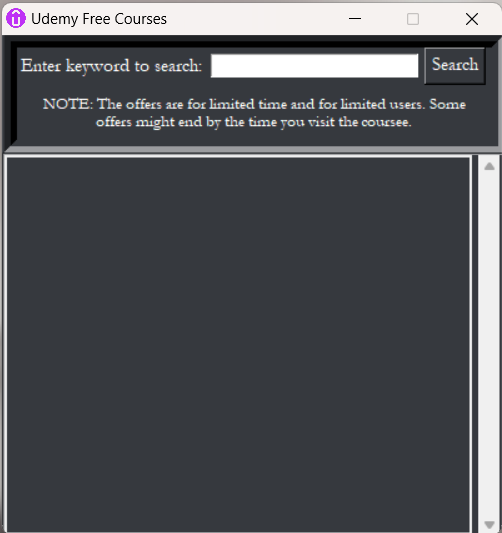
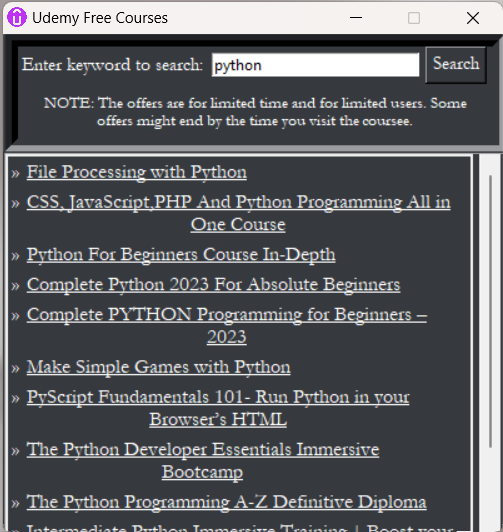

# Udemy Free Course Grabber

## Overview
This application provides a convenient way to discover and download Udemy's free courses from the website "answersq.com." It is packaged as a standalone Windows executable (.exe) file, eliminating the need for Python or any dependencies. Users can easily search for courses through a user-friendly graphical interface.

## Features
- **Course Scraping:** Fetches Udemy course details from "answersq.com," ensuring you have access to the latest free courses.
- **Search Functionality:** Allows users to search for specific courses using keywords.
- **Standalone Application:** No Python or external dependencies are required. Just run the .exe file.

## Usage
1. Download the "Udemy.exe" file from the [Releases](https://github.com/N00BSC00B/Udemy-Free-Course-Grabber/releases/) section of this GitHub repository.

2. Double-click the "Udemy.exe" file to launch the application.

3. The application window will open, allowing you to start scraping and exploring Udemy free courses.

## Screenshots

*Main application window displaying Udemy free courses.*

*Application window displaying Udemy free courses after search.*

## Disclaimer
This application is intended for educational purposes only. Be aware that web scraping may violate the terms of service of the websites being scraped. Use this tool responsibly and ensure compliance with the policies of the website being scraped.

## Contributions
Contributions to this project are welcome! If you encounter any issues or have suggestions for improvements, please create a GitHub issue or submit a pull request.

## License
This project is licensed under the MIT License. See the [LICENSE](LICENSE) file for details.

## Author
Sayan Barma

Feel free to contact me if you have any questions or feedback about this application. Enjoy exploring Udemy's free courses!
 a python application
